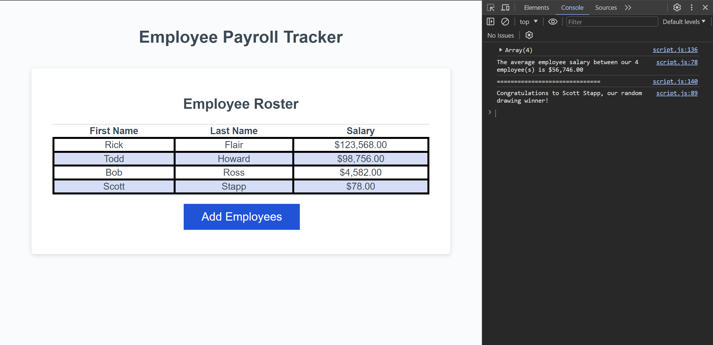

# employee-payroll-tracker-3

Description: This repo was created with the intent of showing how to create objects from arrays and use those objects to do other functions such as finding the average of a set of numbers or choosing array items at random.

Installation: N/A

Usage: To use this repo, you can dig through the javascript file and see basic ways to collect information and create objects with said information, make random selections from array items, and find the sum and average of numbers as well as how to log this information to the console.

Link to site: https://stringer-j.github.io/employee-payroll-tracker-3/

Credits: N/A

License: Refer to the LICENSE in the repo.

Note for grading staff: I used the 'Xpert Learning Assistant' for help with things I didn't understand as I wrote the code.